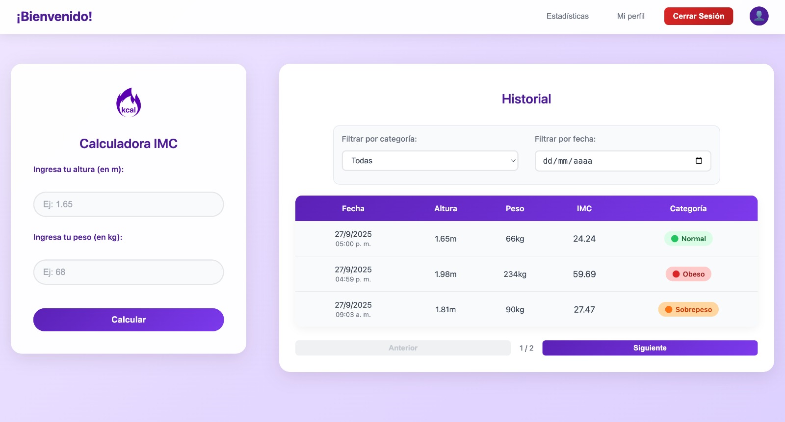

# Proyecto: Calculadora IMC 

Este proyecto consiste en una aplicación web para calcular el índice de Masa Corporal (IMC) a partir de los datos de peso y altura ingresados por el usuario.
El sistema determina la categoría correspondiente (bajo peso, normal, sobrepeso, obesidad, etc.) y está dividido en frontend y backend, desplegados en la web para acceso público.


# Objetivos del Proyecto

* Desplegar la aplicación en un hosting público  
* Validar la comunicación entre frontend y backend  
* Documentar el proceso de despliegue y problemas encontrados  
* Aplicar prácticas ágiles (Scrum + Kanban)  

# Requisitos 

* Node.js v18 o superior

* GitHub para repositorios

* Postman para pruebas de API

* Hosting: Render (backend) y Vercel (frontend)

## Instalación

Backend (NestJS)

1. Clonar el repositorio
```bash
  git clone https://github.com/fedeeperon/proyecto_iyc_back
  cd proyecto_iyc_back
```
2. Instalar dependencias
```bash
  npm install
```
3. Ejecutar en desarrollo
```bash
  npm run start:dev
```
4. Compilar y ejecutar en producción
```bash
  npm run build
  npm run start
```

Frontend (React + Vite)

1. Clonar repositorio
```bash
  git clone https://github.com/fedeeperon/proyecto_iyc_front
  cd proyecto_iyc_front
```

2. Instalar dependencias
```bash
  npm install
```
3. Archivo .env
```bash
    VITE_API_URL=https://proyecto-iyc-back.onrender.com
```
4. Ejecutar en desarrollo
```bash
  npm run dev
```
## Despliegue del Proyecto

El proyecto se despliega con:

### Backend en Render
1. Iniciar sesión en Render con GitHub.
2. Crear un nuevo servicio: New → Web Service.
3. Seleccionar el repositorio del backend.
4. Configurar los comandos:
Build command
```bash
  npm install && npm run build
```
Start command
```bash
  npm run start
```
5. Deployar y obtener la URL pública del backend:

https://proyecto-iyc-back.onrender.com/

### Frontend en Vercel
1. Ingresar a Vercel y conectar el repositorio del Frontend.
2. Configurar la variable de entorno:
```bash
    VITE_API_URL=https://proyecto-iyc-back.onrender.com
```
3. Realizar Deploy y obtener el dominio público para acceder a la app. 

https://proyecto-iyc-front.vercel.app/

## Autenticación
- Regístrate: `POST /auth/register { email, password }`
- Login: `POST /auth/login { email, password }` → `{ access_token }`
- Rutas protegidas: usar header `Authorization: Bearer <token>`

## Endpoints principales

### Auth (`/auth`)
- `POST /auth/register` → Crea usuario y devuelve token.
- `POST /auth/login` → Valida credenciales y devuelve token.

### Users (`/users`) [Protegido]
- `GET /users/profile` → Perfil del usuario autenticado.
- `GET /users` → Lista de usuarios.
- `PATCH /users/:id` → Actualiza usuario (email/password).

### IMC (`/imc`) [Protegido]
- `POST /imc/calcular` → Calcula y guarda IMC.
  - Body: `{ peso: number (0<p<500), altura: number (0<a<3) }`
  - Respuesta (ejemplo): `{ peso, altura, imc, categoria, fecha }`
- `GET /imc/historial?esDescendente=true&skip=0&take=10` → Historial paginado del usuario.
- `GET /imc/estadisticas` → Estadísticas agregadas para gráficos.

## Estadísticas para gráficos (Recharts)
En el frontend (React) utilizamos Recharts para visualizar los datos de `/imc/estadisticas`.

Respuesta de ejemplo:

```json
{
  "imcMensual": [ { "mes": "ene", "imc": 23.1 }, { "mes": "feb", "imc": 22.8 } ],
  "promedioIMC": 22.95,
  "variacionPeso": [ { "mes": "ene", "peso": 72.4 }, { "mes": "feb", "peso": 71.8 } ]
}
```

Uso sugerido con Recharts:
- `LineChart` o `AreaChart` con `dataKey="imc"` sobre `imcMensual`.
- `BarChart` o `LineChart` con `dataKey="peso"` sobre `variacionPeso`.
- Eje X: `mes`. Orden esperado: `ene, feb, mar, abr, may, jun, jul, ago, sept, oct, nov, dic`.


## Capturas de pantalla 

Vista previa 





## Pruebas

```powershell
npm test
npm run test:e2e
npm run test:cov
```


## Equipo de Desarrollo 

* Gomez Redondo, Laureano

* Lynch, Ramiro

* Mercado Galfré, Llanco

* Milanesio, Hebe del Lourdes

* Perón, Federico

* Romero, Jimena Soledad

* Toranzo, Juan Cruz
